# PROGETTO DI MONITORAGGIO DELLO STATO DELLA VEGETAZIONE DELLA FORESTA UMBRA 🌳
## Esame telerilevamento geo-ecologico in R - 2026
### Giancarlo Maggi


# INTRODUZIONE
###
La riserva naturale Foresta Umbra è un'area naturale protetta posta all'interno del Parco nazionale del Gargano. Si estende nella zona centro-orientale del Gargano, a circa 800 metri di altitudine. La Foresta Umbra occupa un'area di circa 15.000 ettari. La vegetazione che ricopre la Foresta è composta principalmente da faggete vetuste le quali sono relitti glaciali e raggiungono grandi dimensioni nonostante le quote inferiori a cui questi alberi vivono normalmente, per queste particolarità a partire dal 7 luglio 2017 le sue faggete vetuste sono entrate a far parte del patrimonio UNESCO. Il riscldamento globale comporta diversi contributi negativi che tendono a compromettere la salute delle foreste. Tra questi, gli esempi più rilevanti sono  migrazione altitudinale delle specie vegetale e un cambiamento nella fenologia delle specie arboree.

Lo scopo del progetto è quindi quello di analizzare le variazioni multitemporali della copertura vegetale attravarso diversi indici al fine di valutare lo stato di salute e la risposta dell' ecosistemi forestale.


<p align="center">
 
</p>


  

| Finestra Temporale | Intervallo Date | Bande Utilizzate | Indici Calcolati |
| :--- | :--- | :---: | :---: |
| **Estate 2018** (Pre) | 01/07/2018 - 31/08/2018 | B2, B3, B4, B8 | DVI, NDVI, EVI |
| **Estate 2024** (Post) | 01/07/2024 - 31/08/2024 | B2, B3, B4, B8 | DVI, NDVI, EVI |
| **Inverno 2024** | 01/01/2024 - 29/02/2024 | B2, B3, B4, B8 | DVI, NDVI, EVI |

# Metodologia 

## Raccolta delle immagini📂 

Le immagini satellitari provengono da [**Google Earth Engine**](https://earthengine.google.com/) selezionando l'area dell'incendio e le date indicate.
> [!NOTE]
> Il codice JavaScript utilizzato è quello fornito durante il corso ed è disponibile nel file Codice.js

<details>
<summary>
 
 # Setup dell'Ambiente, Importazione Dati e Visualizzazione RGB
 
</summary>
 
## impostiamo la library
````r
library(terra)     # Pacchetto per l'analisi spaziale dei dati con vettori e dati raster
library(imageRy)   # Pacchetto per manipolare, visualizzare ed esportare immagini raster in R
library(viridis)   # Pacchetto per cambiare le palette di colori anche per chi è affetto da colorblindness
library(ggplot2)   # per la costruzione dei grafici  
library(patchwork) # per la composizione di più plot grafici (capacità che manca a ggplot)
library(reshape2)  # trasforma la struttura dei dati  
````

## Importazione e set up della working directory

````r
setwd("C:/Users/giancarlo/Desktop/TELERILEVAMENTO_ESAME")
````
### IMPORTAZIONE E VISUALIZZAZIONE DELLE IMMAGINI NELLE 4 BANDE


````r
wint24 <- rast("umbra_inverno_2024.tif")  
sum24 <- rast("umbra_estate_2024.tif")    
sum18 <- rast("umbra_estate_2018.tif")     
````
> carica e legge il file

````r
plot(wint24)
plot(sum24)
plot(sum18)
````
> visualizza i dati


   
## INVERNO

````r
wint24 <- rast("umbra_inverno_2024.tif") #INVERNO
plot(wint24)
````

<p align="center">
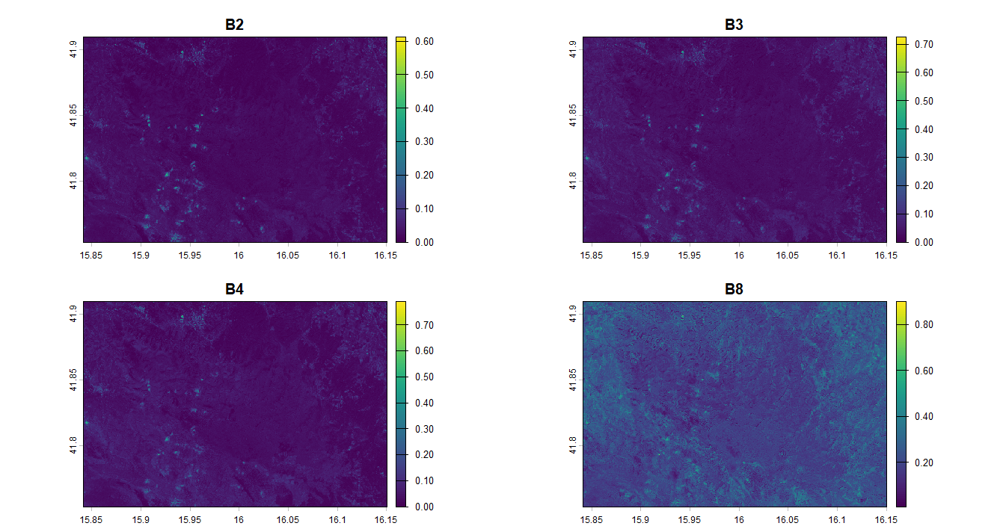
</p>

 
## ESTATE 2024

````r
sum24 <- rast("umbra_estate_2024.tif")   #ESTATE 2024
plot(sum24)
````
<p align="center">
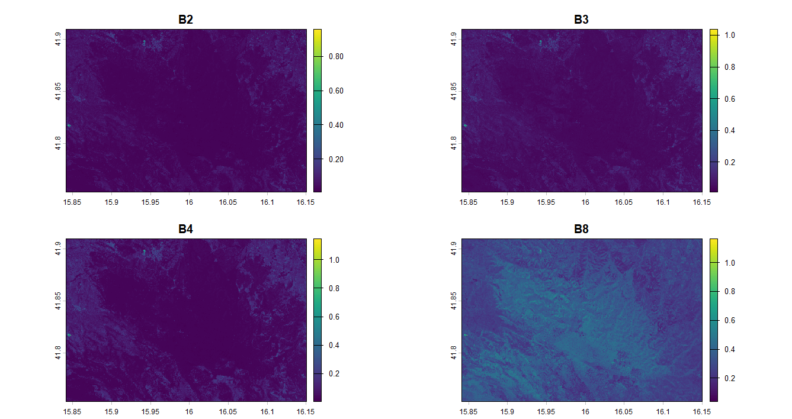
</p>

## ESTATE 2018

````r
sum18 <- rast("umbra_estate_2018.tif")   #ESTATE 2018
plot(sum18)
````
<p align="center">
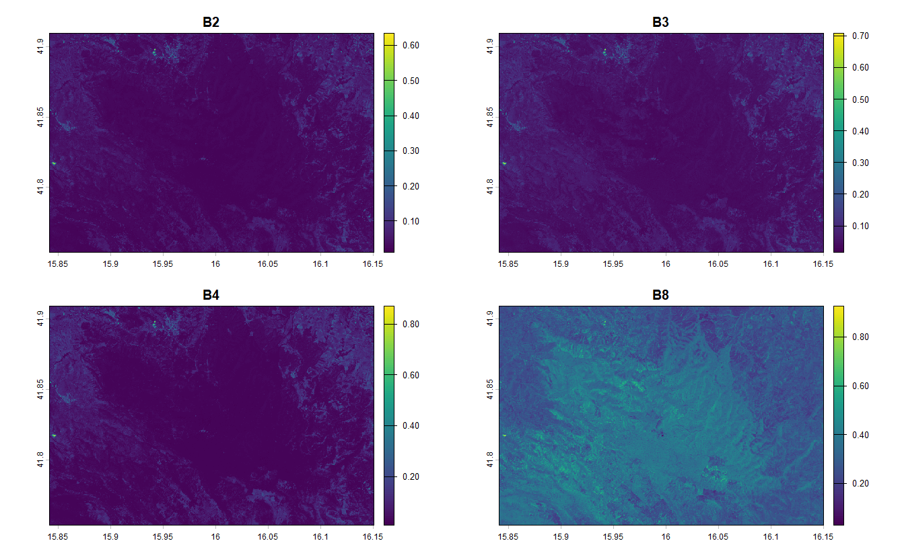
</p>


## VISUALIZZAZIONE DELLE IMMAGINI SCALA RGB

````r
im.multiframe(1,3)     # 1 riga e 3 colonne
im.plotRGB(wint24), r = 3, g = 2, b = 1, title = "Foresta Umbra - Inverno 2024")
im.plotRGB(sum24), r = 3, g = 2, b = 1, title = "Foresta Umbra - Estate 2024")
im.plotRGB(sum18),  r = 3, g = 2, b = 1, title = "Foresta Umbra - Estate 2018")
````
````r
dev.off()               #chiude il grafico
````

<p align="center">
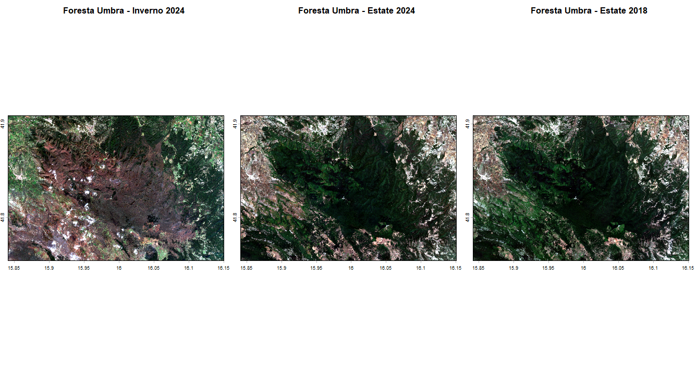
</p>

> Nell' immagine invernale è possibile osservare che la copertura fogliare dei faggi viene persa
</details>

<details>
 <summary>
  
 # DVI, NDVI e EVI
 
 </summary>
 
# DVI (Difference Vegetation Index)

Il **DVI** (*Difference Vegetation Index*, o Indice di Vegetazione per Differenza) è uno dei più semplici e storici indici spettrali utilizzati nel telerilevamento per il monitoraggio dello stato della vegetazione.

### A cosa serve?
Il DVI serve principalmente a **quantificare la presenza e la densità della vegetazione verde e sana** sulla superficie terrestre, discriminando i suoli coperti da flora da quelli nudi o antropizzati.

Il suo funzionamento si basa sulla firma spettrale delle piante:
* **Forte assorbimento** della luce nel canale del **Rosso (R/B1)** da parte della clorofilla per la fotosintesi.
* **Forte riflessione** della luce nel canale del **Vicino Infrarosso (NIR/B8)** da parte della struttura cellulare interna delle foglie (mesofillo).

Calcolando la semplice differenza matematica tra la riflettanza del vicino infrarosso e quella del rosso:

$$DVI = NIR - Red$$

L'indice permette di identificare immediatamente il vigore vegetativo. Valori molto alti indicano una vegetazione densa e in salute (come la Foresta Umbra in estate), mentre valori vicini allo zero indicano suolo nudo, rocce, acqua o vegetazione in forte stress/riposo vegetativo questo lo rendono utile

## COME SI MISURA NELLA PRATICA?

````r
dvi_sum24 = sum24[["B8"]] - sum24[["B4"]]    # Calcolo DVI estate 24
dvi_wint24= wint24[["B8"]] - wint24[["B4"]]  # Calcolo DVI inverno 24
dvi_sum18 = sum18[["B8"]] - sum18[["B4"]]    # Calcolo DVI estate 18
````
> impostiamo questo script che serve per calcolare il DVI e nominarlo

## Visualizzazlione dei 3 dati 
````r
im.multiframe(1, 3)
plot(dvi_wint24, main = "DVI Inverno 24' ", col=viridis::viridis(100)) # Visualizzazione DVI inverno
plot(dvi_sum24, main = "DVI Estate 24' ", col=viridis::viridis(100))   # Visualizzazione DVI estate 24
plot(dvi_sum18, main = "DVI Estate 18' ", col=viridis::viridis(100))   # Visualizzazione DVI estate 18
````
````r
dev.off()    #chiude il grafico 
````

<p align="center">
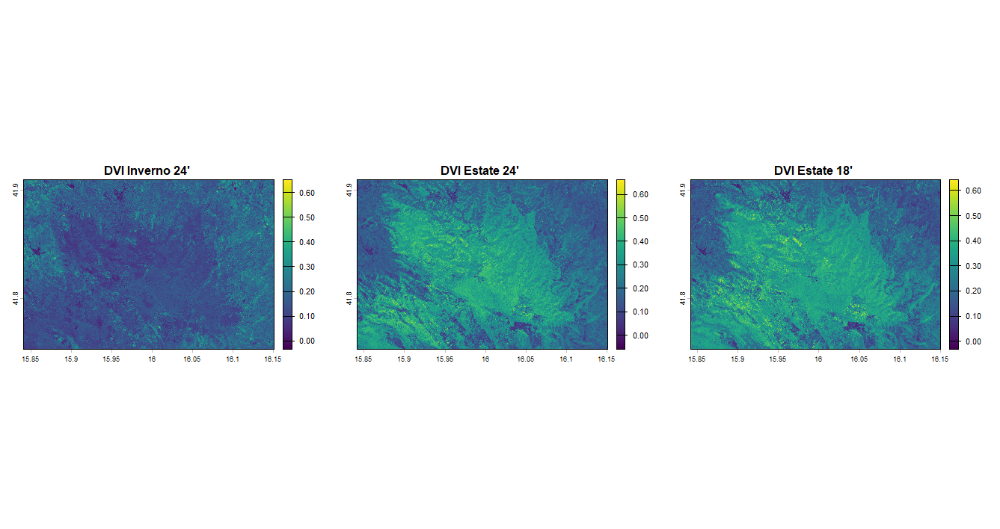
</p>


Il **DVI** mostra zone di riflettanza bassa (viola scuro) associato a suoli nudi, acque o scarsa vegetazione e valori di alta riflettanza (giallo) dovuta ad un intensa attività vegetativa. La **differenza stagionale** è molto accentuata mentre quella **temporale** (stessa stagione) è quasi impercettibile.


## ΔDVI 
Viene calcolato per quantificare la variazione della biomassa e della salute della vegetazione tra due momenti diversi.

- Osserviamo la crescita della biomassa fogliare nella foresta con questo indice
  
````r
ddvi_stagionale = dvi_sum24 - dvi_wint24                                         # Differenza DVI stagionale 2024 
plot(ddvi_stagionale, main = "ΔDVI Stagionale' ", col=viridis::inferno(100))     # plottiamo con viridis inferno 
````
<p align="center">
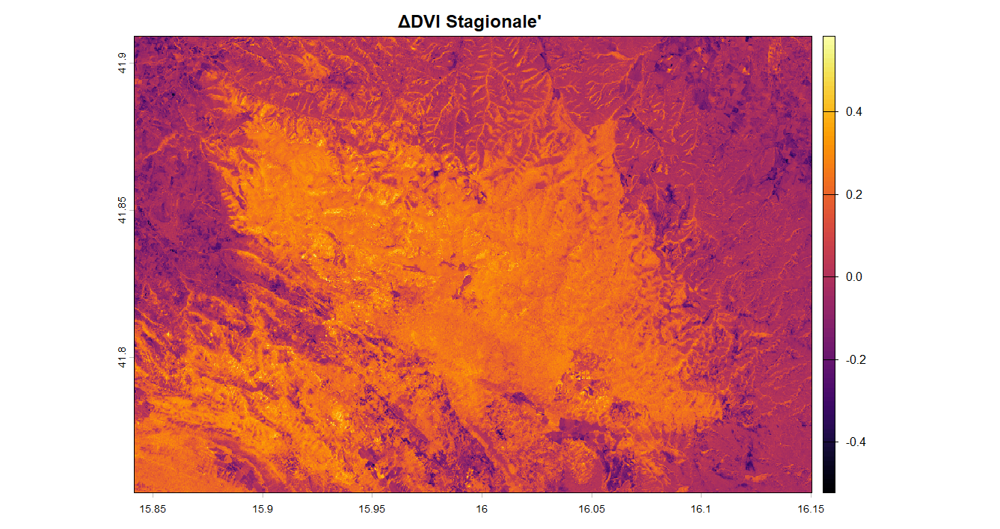
</p>

Nel **ΔDVI** si notano zone con un intensa aumento della massa fogliare indicate giallo/arancio intenso dovute alla gemmazione della foresta nel periodo estivo e perdite della vegetazione blu scuro.

# NDVI (normalized deifference vegetation index)

L'**NDVI** (Normalized Difference Vegetation Index) è l'indice satellitare usato per misurare la **salute e la densità della vegetazione**.

### Come funziona
Sfrutta il fatto che le piante sane **assorbono il Rosso** (per fare fotosintesi) e **riflettono il Vicino Infrarosso (NIR)**.

La formula è:
$$NDVI = \frac{NIR - RED}{NIR + RED}$$

### Scala dei valori (da -1 a +1)
* **Valori negativi (< 0):** Acqua, neve, nuvole.
* **Vicino a Zero (0 - 0.1):** Cemento, roccia, suolo nudo.
* **Valori Bassi/Medi (0.2 - 0.5):** Prati secchi, vegetazione rada o sofferente.
* **Valori Alti (0.6 - 1.0):** Foreste fitte, vegetazione sana e rigogliosa.

### Applichiamo la formula e nominiamo i file

````r
ndvi_wint24 = (wint24[["B8"]] - wint24[["B4"]]) / (wint24[["B8"]] + wint24[["B4"]]) 
ndvi_sum24 = (sum24[["B8"]] - sum24[["B4"]]) / (sum24[["B8"]] + sum24[["B4"]])
ndvi_sum18 = (sum18[["B8"]] - sum18[["B4"]]) / (sum18[["B8"]] + sum18[["B4"]]) 
````
### procediamo alla visualizzazione

````r
im.multiframe(1,3)  #  Visualizzazione di un pannello grafico con 1 righa e 3 colonne
plot(ndvi_wint24, main="NDVI Inverno 24' ", col=viridis::viridis(100)) 
plot(ndvi_sum24, main="NDVI Estate 24'", col=viridis::viridis(100)) 
plot(ndvi_sum18, main="NDVI Estate 18'", col=viridis::viridis(100)) 
````

<p align="center">
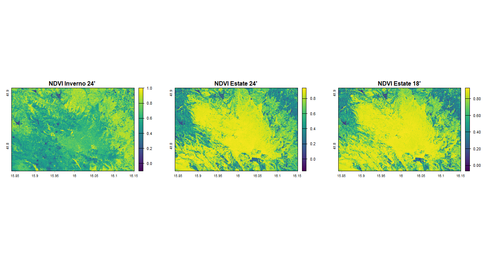
</p>

## osserviamo anche il  ΔDVI


````r
dndvi_stagionale = ndvi_sum24 - ndvi_wint24 #differenza NDVI
dndvi_temporale = ndvi_sum18 - ndvi_sum24 
````
````r
im.multiframe(1,2)
plot(dndvi_stagionale, main="ΔNDVI Stagionale", col=colorRampPalette(c("red", "white", "blue"))(100))  
plot(dndvi_temporale, main="ΔNDVI Temporale", col=colorRampPalette(c("red", "white", "blue"))(30)) 
````
<p align="center">
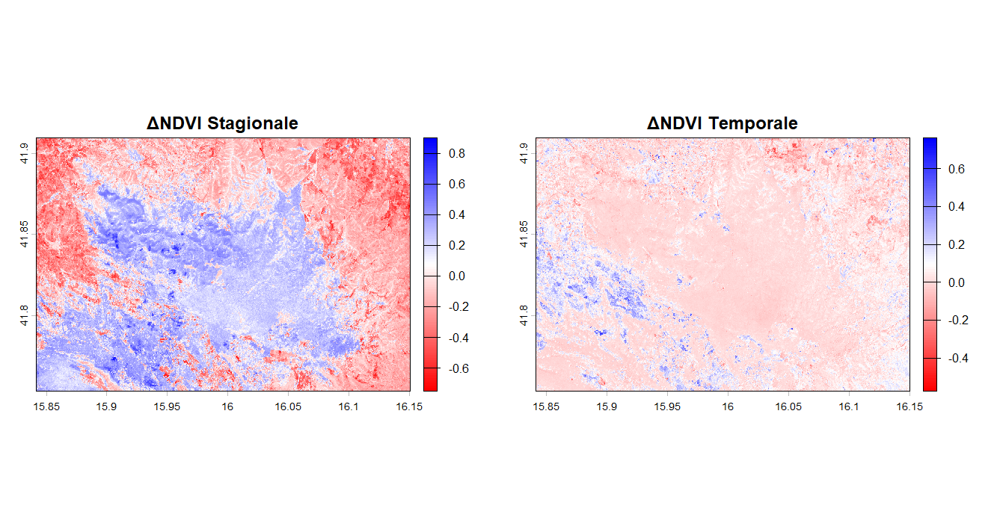
</p>

osserviamo in **rosso** (valori <1) una perdita di biomassa fogliare, in **bianco** (valore = 0) la stabilità di vegetazione e in **blu**(valori >1) un guadagno nella biomassa fogliare.

- Con il **ΔDVI Stagionale** si percepisce la diferenza nella perdità della massafogliare
- Con il **ΔDVI Temporale** si osserva una colorazione tendente allo 0.

# L'EVI (Enhanced Vegetation Index)

Nonostante l'NDVI sia un ottimo indicatore macroscopico, in contesti forestali ad altissima densità fogliare come la **Foresta Umbra** presenta due limiti:

1. **Saturazione:** Nel picco estivo, la chioma diventa così fitta che l'NDVI si "appiattisce" su valori massimi (intorno a 0.85 - 0.90), non riuscendo più a distinguere le reali variazioni strutturali o di densità fogliare tra l'estate del 2018 e quella del 2024.
2. **Sensibilità al background e all'atmosfera:** Risente del disturbo del suolo sottostante e dell'aerosol atmosferico

L' [EVI](https://custom-scripts.sentinel-hub.com/sentinel-2/evi/) mantiene una risposta lineare anche ad alti livelli di biomassa e introduce coefficienti di correzione per l'atmosfera (tramite la banda del **Blu**) e per il suolo. 

### La formula matematica dell'EVI è:

$$EVI = G \times \frac{NIR - RED}{NIR + C_1 \times RED - C_2 \times BLUE + L}$$

I parametri standard utilizzati (derivati dai sensori MODIS/Landsat/Sentinel) sono:
* $G = 2.5$ (Fattore di guadagno)
* $L = 1$ (Coefficiente di regolazione per il background del suolo)
* $C_1 = 6$ e $C_2 = 7.5$ (Coefficienti per la correzione degli aerosol atmosferici che sfruttano la banda del Blu)


Grazie a questa formulazione, l'EVI riesce a "isolare" il segnale puro della vegetazione fitta, permettendoci di mappare l'effettiva eterogeneità e lo stato di salute della foresta nelle due stagioni estive a confronto senza incorrere nel fenomeno della saturazione.

### calcoliamo EVI
````r
evi_sum24 = 2.5 * ((sum24[[4]] - sum24[[3]]) / (sum24[[4]] + 6 * sum24[[3]] - 7.5 * sum24[[1]] + 1))  #formula e nominazione
evi_sum18 = 2.5 * ((sum18[[4]] - sum18[[3]]) / (sum18[[4]] + 6 * sum18[[3]] - 7.5 * sum18[[1]] + 1))  #formula e nominazione
````

````r
im.multiframe(2,1)
plot(evi_sum18, main = "EVI Estate 18'", col= viridis::viridis(100), range = c(-1, 1))  
plot(evi_sum24, main = "EVI Estate 24'", col= viridis::viridis(100), range = c(-1, 1))
````
> ho inserito un range fra -1 e +1 per due ragioni, avere una scala di comparabilità e per rispecchiare la scala dell'indice

<p align="center">
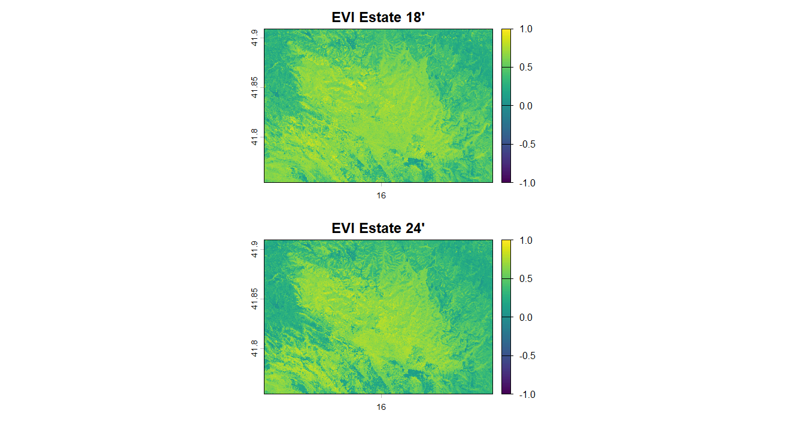
</p>

## Osserviamo il ΔEVI

````r
devi_temporale = evi_sum24 - evi_sum18
plot(devi_temporale, main = "ΔEVI Temporale", col=colorRampPalette(c("red","white","darkgreen"))(100))
````

<p align="center">
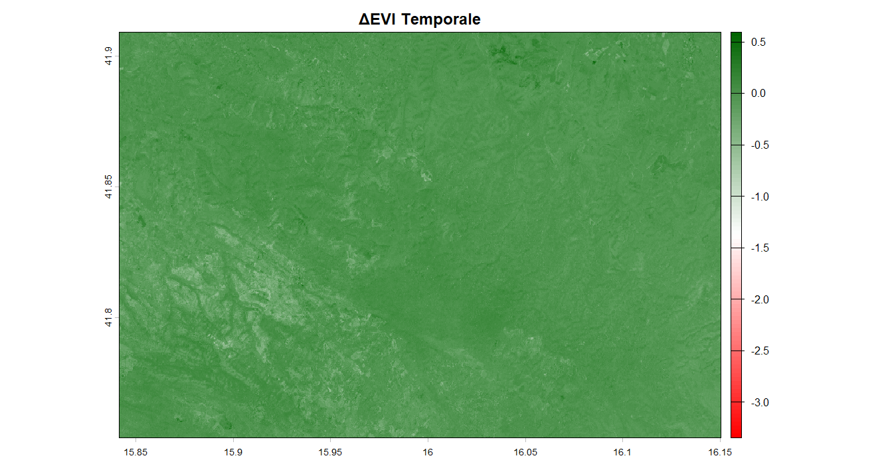
</p>

> la vegetazione sana generalmente varia fra 0.20 e 0.80

</details>
<details>
 <summary>
  
  # ANALISI MULTITEMPORALE
 </summary>


In questa sessione viene eseguito un confronto multitemporale degli indici **NDVI** ed **EVI** tra il 2018 e il 2024. 
L'analisi multitemporale serve a **identificare e quantificare i mutamenti della copertura vegetale nel corso del tempo**, consentendo di monitorare lo stato di salute della foresta matura e mappare eventuali dinamiche di degradazione o rigenerazione ambientale.

##  ANALISI MULTITEMPORALE NDVI

````r
soglia = 0.6            # Soglia NDVI per distinguere vegetazione/non vegetazione
classe_invernale=classify(ndvi_wint24,  rcl=matrix(c(-Inf,soglia,0, soglia,Inf,1), ncol=3, byrow=TRUE))  
classe_estiva24=classify(ndvi_sum24, rcl=matrix(c(-Inf,soglia,0, soglia,Inf,1), ncol=3, byrow=TRUE))
classe_estiva18=classify(ndvi_sum18, rcl=matrix(c(-Inf,soglia,0, soglia,Inf,1), ncol=3, byrow=TRUE))
````

- Con questo script creiamo una classificazione che serve a semplificare i dati e a darci solamente 1 e 0 in modo da semplificare la visualizzazione
 

### visualizziamo l' immagine

````r
im.multiframe(3,1)
plot(classe_invernale, main="Classi NDVI Invernale", col=c("red","green")) 
plot(classe_estiva24, main="Classi NDVI Estiva24", col=c("red","green"))
plot(classe_estiva18, main="Classi NDVI Estiva18", col=c("red","green"))
````
<p align="center">
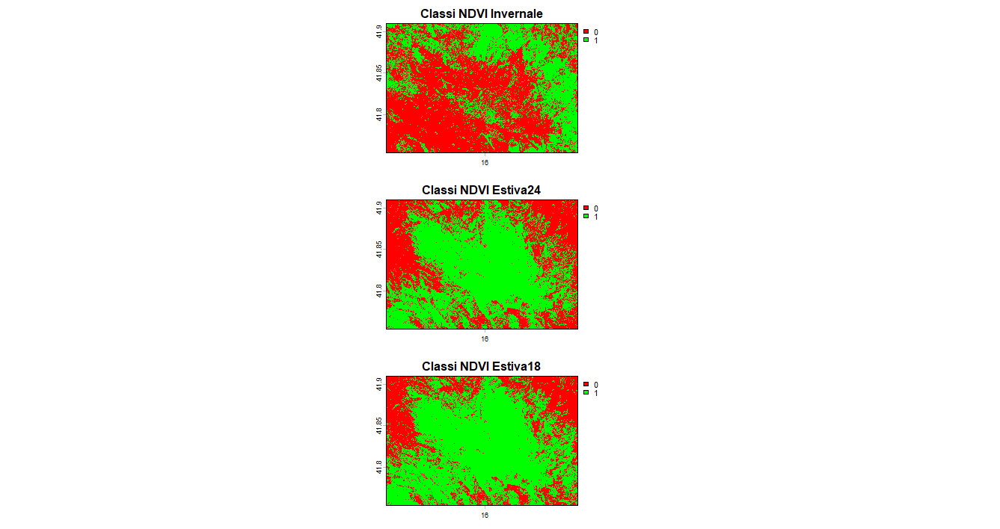
</p>

 * **Valore `0` (Vegetazione Diradata / Suolo Nudo):** Assegnato a tutti i pixel con valori di NDVI inferiori o uguali a $0.7$ ($-\infty \le \text{NDVI} \le 0.7$). Rappresenta superfici non forestali, suolo nudo, aree urbane, corpi idrici o zone in cui la copertura vegetale è fortemente rada, degradata o senescente (come nel caso del dataset invernale).
  * **Valore `1` (Foresta Matura):** Assegnato a tutti i pixel con valori di NDVI superiori a $0.7$ ($0.7 < \text{NDVI} \le +\infty$). Identifica la presenza di vegetazione densa, vigorosa e in salute, tipica della copertura forestale matura nel pieno della sua attività fotosintetica.

### Calcolo dati percentuali
````r
freq_24 = freq(classe_estiva24)     #calcola quanti pixel appartengono a 0 e quanti a 1 in maniera assoluta
freq_18 = freq(classe_estiva18)     #calcola quanti pixel appartengono a 0 e quanti a 1 in maniera assoluta
freq_wint = freq(classe_invernale)  #calcola quanti pixel appartengono a 0 e quanti a 1 in maniera assoluta
````
````r
perc_24 = freq_24$count  * 100 / ncell(classe_estiva24)       #conta il numero di pixel 0 e 1 e fa percentuale
perc_18 = freq_18$count * 100 / ncell(classe_estiva18)        #conta il numero di pixel 0 e 1 e fa percentuale
perc_wint = freq_wint$count * 100 / ncell(classe_invernale)   #conta il numero di pixel 0 e 1 e fa percentuale
````

### Visualizzazione nella tabella

````r
tabella = data.frame(                                                      # organizza i dati una tabella
  Classe = c("Vegetazione Diradata / Suolo", "Foresta matura"),            # indica quali sono gli argomenti
  Estate_2018 = round(perc_18,2),                                          # il 2 indica le cifre decimali 
  Estate_2024= round(perc_24,2),
  Inverno = round(perc_wint,2)
  
 )
 tabella                                                                    #visualizza la tabella su
````

| Classe | Estate 2018 (%) | Estate 2024 (%) | Inverno (%) |
| :--- | :---: | :---: | :---: |
| **Vegetazione Diradata / Suolo** | 32.66 | 40.01 | 60.70 |
| **Foresta matura** | 67.34 | 59.99 | 39.30 |

## Grafico comparativo GGPLOT NDVI

````r
df_long = melt(tabella, id.vars="Classe",                       # Converte la tabella in formato lungo per il grafico
                variable.name="Periodo",
                value.name="Percentuale")

                                
ggplot(df_long, aes(x=Classe, y=Percentuale, fill=Periodo)) +     # Crea Grafico assegnando X, Y e colore pieno
  geom_bar(stat="identity", position="dodge", color = "black") +  # Barre affiaancate per confrontare i periodi 
  geom_text(aes(label=round(Percentuale,1)),                      # Aggiunge i valori sulle barre
            position=position_dodge(width=0.9),                   # Allinea il testo sulle barre affiancate
            vjust=-0.25,                                          # Sposta leggermente sopra le barre
            size=3) +                                             # Dimensione testo
  scale_fill_manual(values = c("Estate_2018" = "#008B00",         # Colori distinti per i periodi
                               "Estate_2024" = "#00FF00",
                               "Inverno" = "lightskyblue")) +                                      
  ylim(0,100) +                                                   # Limiti asse Y 0-100%
  labs(title="Copertura forestale (NDVI > 0.6)",                  # Titoli ed etichette
       y="Percentuale (%)", x="Classe NDVI") +
  theme_grey()        
````

<p align="center">
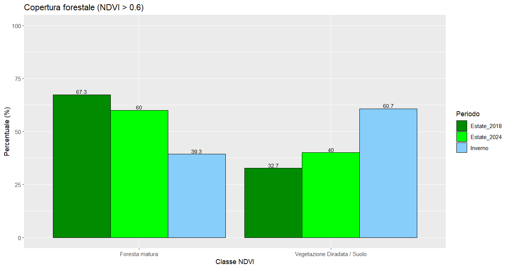
</p>

# ANALISI MULTITEMPORALE EVI

L'utilizzo dell'indice EVI in questa analisi multitemporale permette di **ridurre gli effetti di disturbo atmosferico e della riflettanza del suolo nudo**, offrendo una stima più robusta e sensibile del reale vigore della biomassa fotosinteticamente attiva, specialmente in aree a densa copertura fogliare.
````r
soglia = 0.5                              # Soglia EVI per distinguere vegetazione/non vegetazione

classe_estiva24=classify(evi_sum24, rcl=matrix(c(-Inf,soglia,0, soglia,Inf,1), ncol=3, byrow=TRUE))
classe_estiva18=classify(evi_sum18, rcl=matrix(c(-Inf,soglia,0, soglia,Inf,1), ncol=3, byrow=TRUE))
````
> Con questo script creiamo una classificazione che serve a semplificare i dati e a darci solamente 1 e 0 in modo da semplificare la visualizzazione

````r
im.multiframe(1,2)
plot(classe_estiva18, main="Classi EVI Estiva18", col=c("red","green"))
plot(classe_estiva24, main="Classi EVI Estiva24", col=c("red","green"))
````
<p align="center">
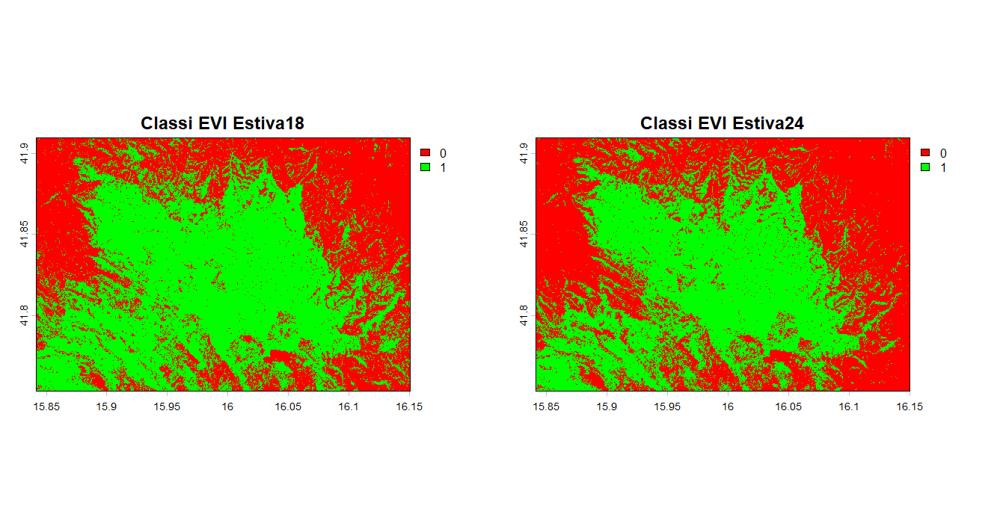
</p>

````r
freq_24 = freq(classe_estiva24) 
freq_18 = freq(classe_estiva18)

perc_24 = freq_24$count  * 100 / ncell(classe_estiva24)
perc_18 = freq_18$count * 100 / ncell(classe_estiva18)

tabella = data.frame(
  Classe = c("Vegetazione rada", "Foresta matura"),
  Estate_2018 = round(perc_18,2),
  Estate_2024= round(perc_24,2)
 
  
 )
  print(tabella)
  ````

  | Classe | Estate 2018 (%) | Estate 2024 (%) |
| :--- | :---: | :---: |
| **Vegetazione rada** | 44.41 | 52.24 |
| **Foresta matura** | 55.59 | 47.76 |


# GRAFICO COMPARATIVO GGPLOT EVI

  ````r
df_long = melt(tabella, id.vars="Classe",                          # Converte la tabella in formato lungo per il grafico
                variable.name="Periodo",                           
                value.name="Percentuale")

                                
ggplot(df_long, aes(x=Classe, y=Percentuale, fill=Periodo)) +      # Crea Grafico assegnando X, Y e colore
  geom_bar(stat="identity", position="dodge", color = "black") +   # Barre affiaancate per confrontare i periodi
  geom_text(aes(label=round(Percentuale,1)),                       # Aggiunge i valori sulle barre
            position=position_dodge(width=0.9),                    # Allinea il testo sulle barre affiancate
            vjust=-0.25,                                           # Sposta leggermente sopra le barre
            size=3) +                                              # Dimensione testo
  scale_fill_manual(values = c("Estate_2018" = "#008B00",          # Colori distinti per i periodi
                               "Estate_2024" = "#00FF00")) +
                                                                    
  ylim(0,100) +                                                    # Limiti asse Y 0-100%
  labs(title="Copertura forestale (EVI > 0.5)",                    # Titoli ed etichette
       y="Percentuale (%)", x="Classe NDVI") +
  theme_grey()                                                     # Colore tema

  ````

<p align="center">
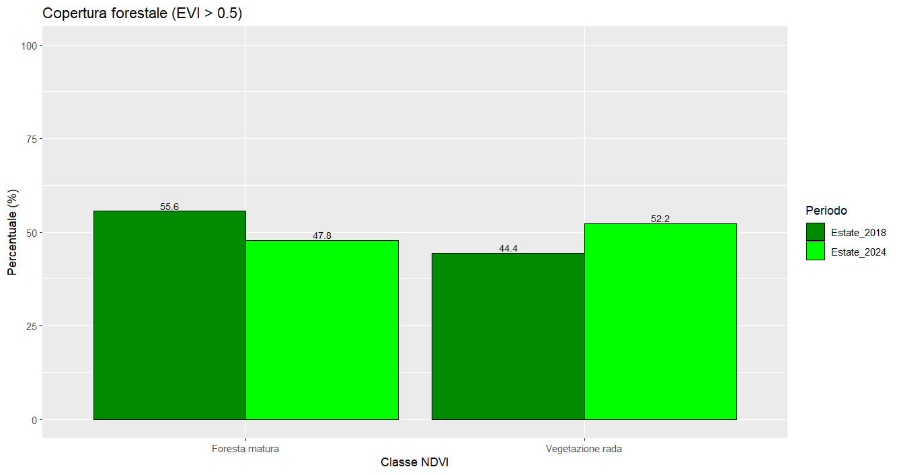
</p>
</details>

# CONCLUSIONI

L'osservazione invernale ha evidenziato una netta perdita della copertura fogliare quantificato dall' indice NDVI, che nel dataset invernale classifica il 60,7% dell'area come "vegetazione diradata/suolo" contro il 39,3% come foresta matura. il  ΔDVI stagionale ha poi ulteriormente  confermato questa differenza
Nel confronto fra i periodi estivi inoltre, attraverso la classificazione NDVI, la classe "foresta matura" ha subito una contrazione della copertura vegetale passando dal 67,34% dell' estate 2018 al 59,99% dell' estate 2024 con un aumento dell'area classificata come vegetazione diradata o suolo.
Infine l'EVI interviene al posto dell'NDVI perchè esso tende a saturarsi in caso di altissima densita confermando la diminuzion della "Foresta matura" passando da 55,6 del 2018 al 47,8 del 2024   
Questi dati potrebbero quindi indicare una situazione di stress dell' ecosistema forestale dovuta a cambiamenti climatici che impattano nella fenologia o semplicemente una riduzione causata da incendi che spesso impattano l' area.


