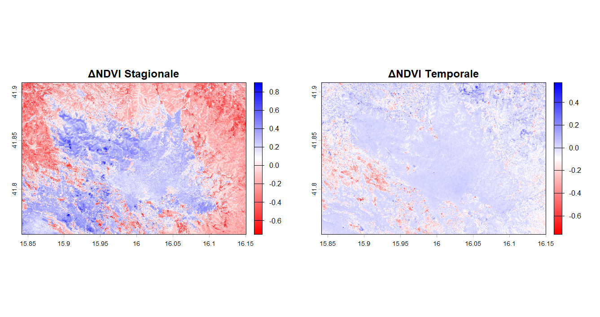

# PROGETTO DI MONITORAGGIO DELLO STATO DELLA VEGETAZIONE DELLA FORESTA UMBRA 🌳
## Esame telerilevamento geo-ecologico in R - 2026
### Giancarlo Maggi

/
/

# INTRODUZIONE
###
La riserva naturale Foresta Umbra è un'area naturale protetta posta all'interno del Parco nazionale del Gargano. Si estende nella zona centro-orientale del Gargano, a circa 800 metri di altitudine. La Foresta Umbra occupa un'area di circa 15.000 ettari. La vegetazione che ricopre la Foresta è composta principalmente da faggete vetuste le quali sono relitti glaciali e raggiungono grandi dimensioni nonostante le quote inferiori a cui questi alberi vivono normalmente, per queste particolarità a partire dal 7 luglio 2017 le sue faggete vetuste sono entrate a far parte del patrimonio UNESCO. Il riscldamento globale comporta diversi contributi negativi che tendono a compromettere la salute delle foreste. Tra questi, gli esempi più rilevanti sono  migrazione altitudinale delle specie vegetale e un cambiamento nella fenologia delle specie arboree.

Lo scopo del progetto è quindi quello di analizzare le variazioni multitemporali della copertura vegetale attravarso diversi indici al fine di valutare lo stato di salute e la risposta dell' ecosistemi forestale.


<p align="center">
 
</p>


  

| Finestra Temporale | Intervallo Date | Bande Utilizzate | Indici Calcolati |
| :--- | :--- | :---: | :---: |
| **Estate 2018** (Pre) | 01/07/2018 - 31/08/2018 | B2, B3, B4, B8 | DVI, NDVI, EVI |
| **Estate 2024** (Post) | 01/07/2024 - 31/08/2024 | B2, B3, B4, B8 | DVI, NDVI, EVI |
| **Inverno 2024** | 01/01/2024 - 29/02/2024 | B2, B3, B4, B8 | DVI, NDVI, EVI |

# Metodologia 

## Raccolta delle immagini📂 

Le immagini satellitari provengono da [**Google Earth Engine**](https://earthengine.google.com/) selezionando l'area dell'incendio e le date indicate.
> [!NOTE]
> Il codice JavaScript utilizzato è quello fornito durante il corso ed è disponibile nel file Codice.js

## impostiamo la library
````r
library(terra)     # Pacchetto per l'analisi spaziale dei dati con vettori e dati raster
library(imageRy)   # Pacchetto per manipolare, visualizzare ed esportare immagini raster in R
library(viridis)   # Pacchetto per cambiare le palette di colori anche per chi è affetto da colorblindness
library(ggplot2)   # per la costruzione dei grafici  
library(patchwork) # per la composizione di più plot grafici (capacità che manca a ggplot)
````

## Importazione e set up della working directory

````r
setwd("C:/Users/giancarlo/Desktop/TELERILEVAMENTO_ESAME")
````
### IMPORTAZIONE E VISUALIZZAZIONE DELLE IMMAGINI NELLE 4 BANDE


````r
wint24 <- rast("umbra_inverno_2024.tif")  
sum24 <- rast("umbra_estate_2024.tif")    
sum18 <- rast("umbra_estate_2018.tif")     
````
> carica e lecce il file

````r
plot(wint24)
plot(sum24)
plot(sum18)
````
> visualizza i dati

<details>
<summary><h2><b>VISUALIZZA I FILE</b></h2></summary>
 
## INVERNO

````r
wint24 <- rast("umbra_inverno_2024.tif") #INVERNO
plot(wint24)
````

<p align="center">

</p>

 
## ESTATE 2024

````r
sum24 <- rast("umbra_estate_2024.tif")   #ESTATE 2024
plot(sum24)
````
<p align="center">

</p>

## ESTATE 2018

````r
sum18 <- rast("umbra_estate_2018.tif")   #ESTATE 2018
plot(sum18)
````
<p align="center">

</p></details>


## VISUALIZZAZIONE DELLE IMMAGINI SCALA RGB

````r
im.multiframe(1,3)     # 1 riga e 3 colonne
im.plotRGB(wint24), r = 3, g = 2, b = 1, title = "Foresta Umbra - Inverno 2024")
im.plotRGB(sum24), r = 3, g = 2, b = 1, title = "Foresta Umbra - Estate 2024")
im.plotRGB(sum18),  r = 3, g = 2, b = 1, title = "Foresta Umbra - Estate 2018")
````
````r
dev.off()               #chiude il grafico
````

<p align="center">

</p>

> Nell' immagine invernale è possibile osservare che la copertura fogliare dei faggi viene persa

# Visualizzazione DVI (Difference Vegetation Index)

Il **DVI** (*Difference Vegetation Index*, o Indice di Vegetazione per Differenza) è uno dei più semplici e storici indici spettrali utilizzati nel telerilevamento per il monitoraggio dello stato della vegetazione.

### A cosa serve?
Il DVI serve principalmente a **quantificare la presenza e la densità della vegetazione verde e sana** sulla superficie terrestre, discriminando i suoli coperti da flora da quelli nudi o antropizzati.

Il suo funzionamento si basa sulla firma spettrale delle piante:
* **Forte assorbimento** della luce nel canale del **Rosso (R/B1)** da parte della clorofilla per la fotosintesi.
* **Forte riflessione** della luce nel canale del **Vicino Infrarosso (NIR/B8)** da parte della struttura cellulare interna delle foglie (mesofillo).

Calcolando la semplice differenza matematica tra la riflettanza del vicino infrarosso e quella del rosso:

$$DVI = NIR - Red$$

L'indice permette di identificare immediatamente il vigore vegetativo. Valori molto alti indicano una vegetazione densa e in salute (come la Foresta Umbra in estate), mentre valori vicini allo zero indicano suolo nudo, rocce, acqua o vegetazione in forte stress/riposo vegetativo questo lo rendono utile

## COME SI MISURA NELLA PRATICA?

````r
dvi_sum24 = sum24[["B8"]] - sum24[["B4"]]    # Calcolo DVI estate 24
dvi_wint24= wint24[["B8"]] - wint24[["B4"]]  # Calcolo DVI inverno 24
dvi_sum18 = sum18[["B8"]] - sum18[["B4"]]    # Calcolo DVI estate 18
````
> impostiamo questo script che serve per calcolare il DVI e nominarlo

## Visualizzazlione dei 3 dati 
````r
im.multiframe(1, 3)
plot(dvi_wint24, main = "DVI Inverno 24' ", col=viridis::viridis(100)) # Visualizzazione DVI inverno
plot(dvi_sum24, main = "DVI Estate 24' ", col=viridis::viridis(100))   # Visualizzazione DVI estate 24
plot(dvi_sum18, main = "DVI Estate 18' ", col=viridis::viridis(100))   # Visualizzazione DVI estate 18
````
````r
dev.off()    #chiude il grafico 
````

<p align="center">

</p>


Il **DVI** mostra zone di riflettanza bassa (viola scuro) associato a suoli nudi, acque o scarsa vegetazione e valori di alta riflettanza (giallo) dovuta ad un intensa attività vegetativa. La **differenza stagionale** è molto accentuata mentre quella **temporale** (stessa stagione) è quasi impercettibile.


## ΔDVI 
Viene calcolato per quantificare la variazione della biomassa e della salute della vegetazione tra due momenti diversi.

- Osserviamo la crescita della biomassa fogliare nella foresta con questo indice
  
````r
ddvi_stagionale = dvi_sum24 - dvi_wint24                                         # Differenza DVI stagionale 2024 
plot(ddvi_stagionale, main = "ΔDVI Stagionale' ", col=viridis::inferno(100))     # plottiamo con viridis inferno 
````
<p align="center">

</p>

Nel **ΔDVI** si notano zone con un intensa aumento della massa fogliare indicate giallo/arancio intenso dovute alla gemmazione della foresta nel periodo estivo e perdite della vegetazione blu scuro.

# VISUALIZZAZIONE l'NDVI 

L'**NDVI** (Normalized Difference Vegetation Index) è l'indice satellitare usato per misurare la **salute e la densità della vegetazione**.

### Come funziona
Sfrutta il fatto che le piante sane **assorbono il Rosso** (per fare fotosintesi) e **riflettono il Vicino Infrarosso (NIR)**.

La formula è:
$$NDVI = \frac{NIR - RED}{NIR + RED}$$

### Scala dei valori (da -1 a +1)
* **Valori negativi (< 0):** Acqua, neve, nuvole.
* **Vicino a Zero (0 - 0.1):** Cemento, roccia, suolo nudo.
* **Valori Bassi/Medi (0.2 - 0.5):** Prati secchi, vegetazione rada o sofferente.
* **Valori Alti (0.6 - 1.0):** Foreste fitte, vegetazione sana e rigogliosa.

### Applichiamo la formula e nominiamo i file

````r
ndvi_wint24 = (wint24[["B8"]] - wint24[["B4"]]) / (wint24[["B8"]] + wint24[["B4"]]) 
ndvi_sum24 = (sum24[["B8"]] - sum24[["B4"]]) / (sum24[["B8"]] + sum24[["B4"]])
ndvi_sum18 = (sum18[["B8"]] - sum18[["B4"]]) / (sum18[["B8"]] + sum18[["B4"]]) 
````
### procediamo alla visualizzazione

````r
im.multiframe(1,3)  #  Visualizzazione di un pannello grafico con 1 righa e 3 colonne
plot(ndvi_wint24, main="NDVI Inverno 24' ", col=viridis::viridis(100)) 
plot(ndvi_sum24, main="NDVI Estate 24'", col=viridis::viridis(100)) 
plot(ndvi_sum18, main="NDVI Estate 18'", col=viridis::viridis(100)) 
````

<p align="center">

</p>

## osserviamo anche il  ΔDVI


````r
dndvi_stagionale = ndvi_sum24 - ndvi_wint24 #differenza NDVI
dndvi_temporale = ndvi_sum18 - ndvi_sum24 
````
````r
im.multiframe(1,2)
plot(dndvi_stagionale, main="ΔNDVI Stagionale", col=colorRampPalette(c("red", "white", "blue"))(100))  
plot(dndvi_temporale, main="ΔNDVI Temporale", col=colorRampPalette(c("red", "white", "blue"))(30)) 
````
<p align="center">

</p>
osserviamo in **rosso** una perdita di biomassa fogliare, in **bianco** la stabilità di vegetazione e in **blu** un guadagno nella biomassa fogliare.

- con il**ΔDVI Stagionale** si percepisce la diferenza nella perdità della massafogliare
- con il **ΔDVI Temporale**


